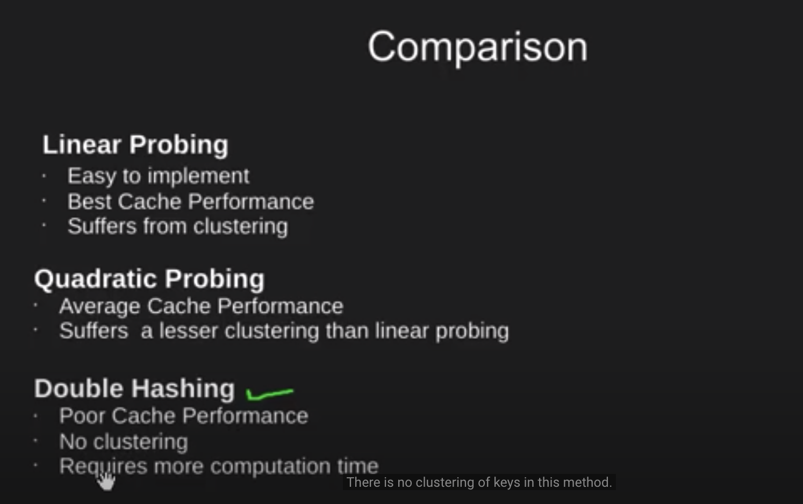

### hashing: provides O(1) time on average for insert, search and delete
### hash function: maps a big no. or string to a small int that can be used as index in hash table

## collision: two keys resulting in same value

### collision handling:
1. seperate chaining: point to a lisked-list
    dis-adv: cache performance
    wastage of space
    search time O(n) in worst case
    extra space for linked lists

    complexity: O(1+alpha)

2. open addressing: all items(keys) are stored in table itself
    1. Linear PRobing
        if (full): try next (ie. increment of 1)
    2. Quadratic Probling
        quadratic increment (1*1, 2*2, 3*3,..)
    3. Double Hashing
        Use of another hash function for increment

### Advantages of BST over hash tables:
1. We can get all keys in sorted order by just doing Inorder Traversal of BST. This is not a natural operation in Hash Tables and requires extra efforts.
2. Doing order statistics, finding closest lower and greater elements, doing range queries are easy to do with BSTs. Like sorting, these operations are not a natural operation with Hash Tables.
3. BSTs are easy to implement compared to hashing, we can easily implement our own customized BST. To implement Hashing, we generally rely on libraries provided by programming languages.
4. With Self-Balancing BSTs, all operations are guaranteed to work in O(Logn) time. But with Hashing, Θ(1) is average time and some particular operations may be costly, especially when table resizing happens.
